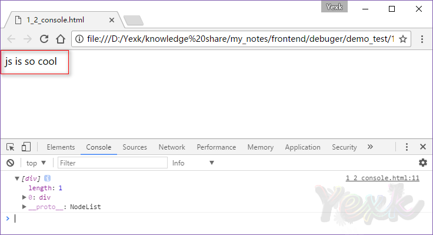
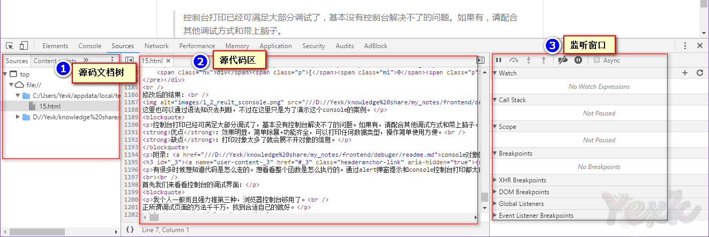
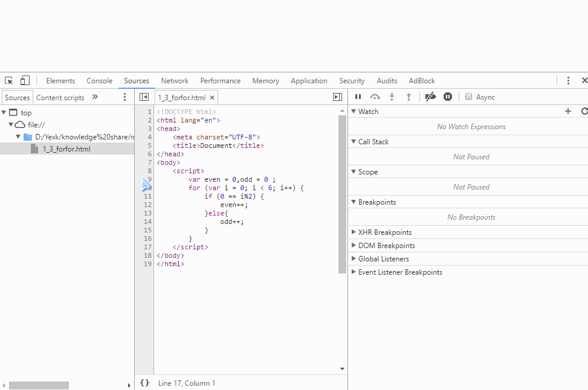
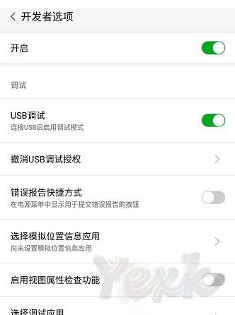
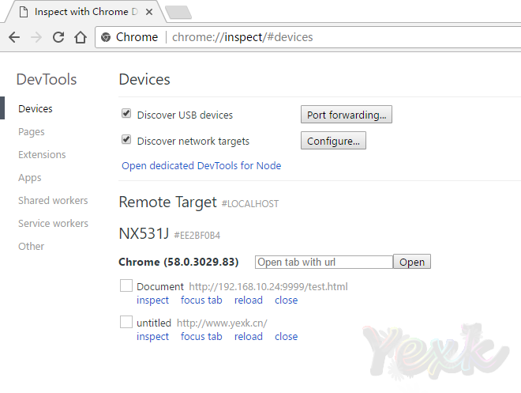
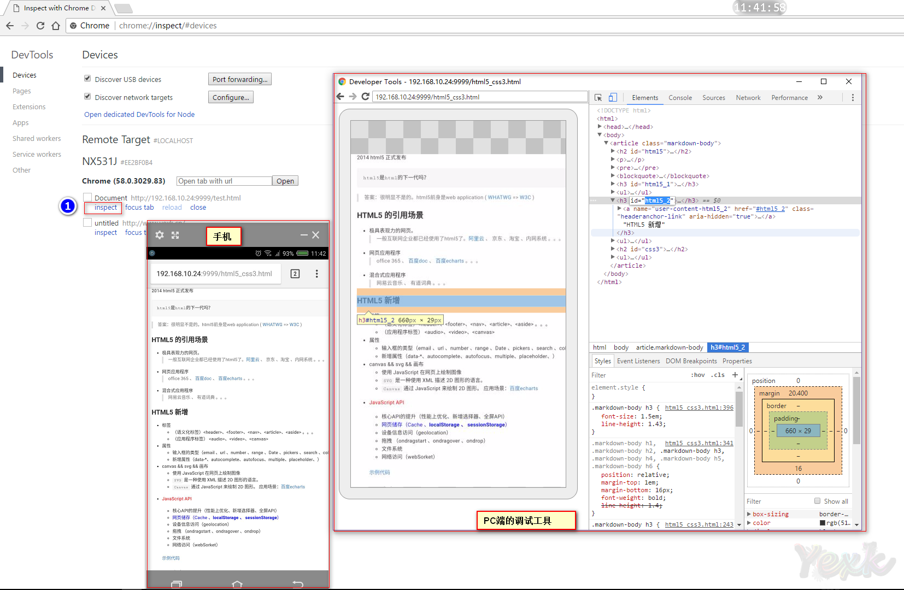
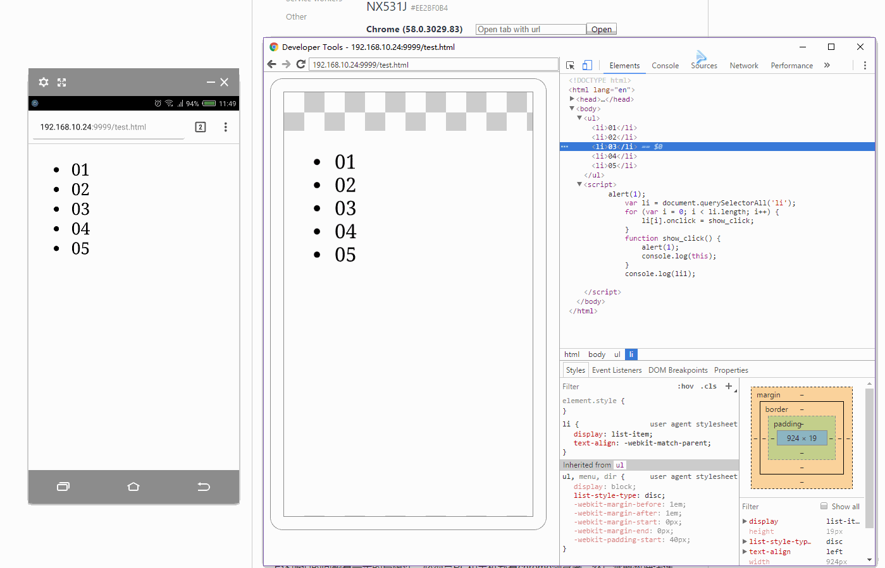
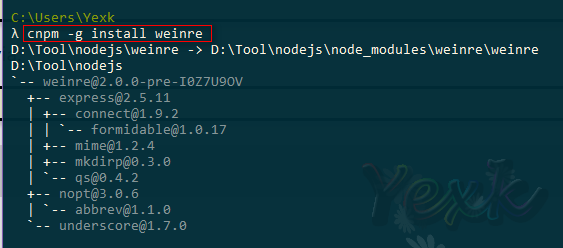
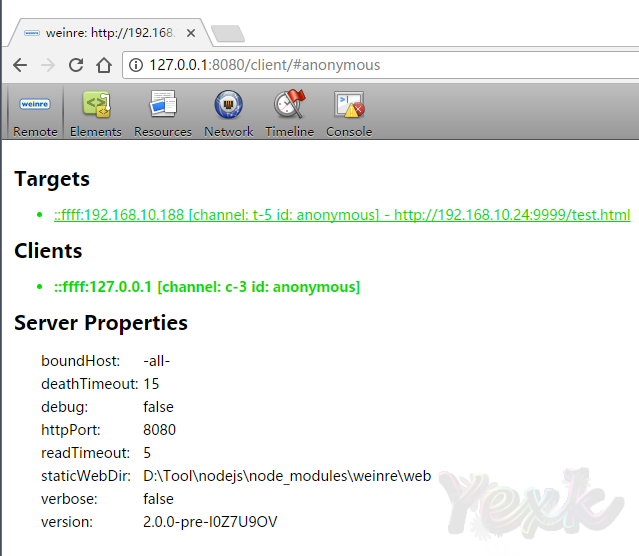
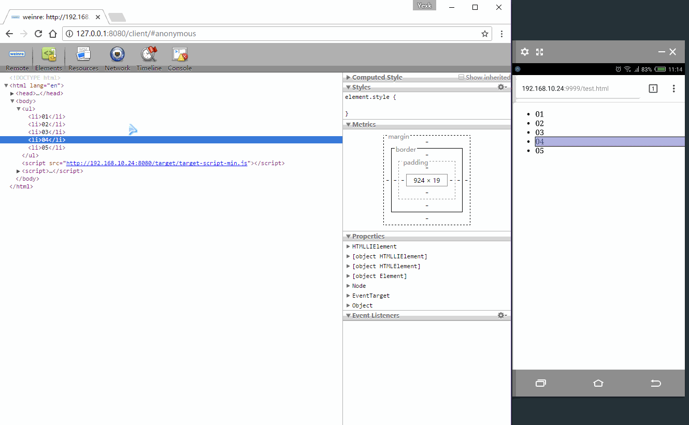

# 移动端JavaScript调试
> 现在移动开发的技术不断成熟，但在移动上面开发调试是很复杂的。遇到些浏览器兼容性问题。且不说解决，能找到问题都是一个很麻烦的事情。
> 此文档适用用于PC端。

## 调试方式
目前我已知的调试方式：

1. 源码调试。
2. alert调试。
3. 浏览器的console打印调试（Chrome DevTools、Firebug）
4. 控制台断点调试
5. Chrome浏览器的ChromeDevTools远程调试
6. weinre调试

### 源码调试
```
推荐指数 ：不推荐
调试难度 ：*****
实用性   ：*
```
查看源代码的方式一步一步的去读代码，然后找到错误并修改。
这方式不适合我这种菜鸟。对于大神，请随意。我比较喜欢直接看结果的调试方式。

> **优点**：可以装x。
> **缺点**：调试时间长，效率低。

### alert调试
```
推荐指数 ：***
调试难度 ：****
实用性   ：** 
```
`alert()`方法的初衷是为了通过弹窗的方式，来警告或提示用户做对应的操作，并且有强制中断效果。
目前对于弹窗已经有许多替代品，而默认的alert常常都是用于调试。在我觉得有错误的位置前后操作。如果有弹窗就说明没问题。否则就出现问题。

**例如**：有以下这段js代码([1_1_alert.html](demo_test/1_1_alert.html))
```html
<!DOCTYPE html>
<html lang="en">
<head>
	<meta charset="UTF-8">
	<title>1_1_alert.html</title>
</head>
<body>
	<script>
		// 这里有很多很多代码。。。
		alert(1);
		document.getElementById('ye_test_1').innerHTML = "Yexk";
		alert(2);
		// 这里有很多很多代码。。。
	</script>
</body>
</html>
```
通过访问发现，这里只弹出了1，没有弹出2，那就是这两行代码中间出现了问题。
去寻找问题，发现了这行代码的意思是找到元素的ID为ye\_test\_1。但这个文档里面是没有这个元素的，所以报错了。
解决办法根据实际开发情况去更改代码就可以了。

> 首先找到这段代码自己觉得有问题的地方，然后对这段代码进行前后加上alert()。
> 要是找不出问题在哪也没有关系，可以在一些关键的地方进行加上调试，然后进一步的缩小范围。
> **优点**：效果明显，简单除暴。
> **缺点**：操作麻烦，只能打印基本数据类型（字符串，数字，等）

个人觉得这个调试虽然这方法简单粗暴，但是有利有弊，并且利小于弊。比如在for循环里面查看里面的执行情况，那就太麻烦了。这个可以根据实际情况酌情选择。

### 浏览器的console打印调试
```
推荐指数 ：*****
调试难度 ：****
实用性   ：**** 
```
控制台调试工具，目前属于最好用的调试工具，没有有之一。目前常用的：[Chrome DevTools](https://developers.google.com/web/tools/chrome-devtools/)（Chrome浏览器自带）、Firebug（需要自行安装）、其他浏览器自带的。
调试方法相对文艺，功能强大。可以查看具体的执行位置，报错的位置。
**例如**：下面这个代码([1_2_console.html](demo_test/1_2_console.html))
对下面的div进行赋值为"js is so cool!"
```html
<!DOCTYPE html>
<html lang="en">
<head>
	<meta charset="UTF-8">
	<title>1_2_console.html</title>
</head>
<body>
	<div>1</div>
	<script>
		var div = document.querySelectorAll('div');
		div.innerHTML = 'js is so cool';
	</script>
</body>
</html>
```
类似这种错误，通过上面所说的alert方法就调试不出为啥，因为语法没有错误。这里可以通过查看获取的div对象查找原因。
代码改成：
```JavaScript
	var div = document.querySelectorAll('div');
	console.log(div);
	div.innerHTML = 'js is so cool';
```
结果：

可以发现获取的div元素是被一个数组给包裹起来了。而对div直接复制相当于给数组添加一个键值对。所以这里要想取得div元素对象，只要在取得div数组里下标为0的元素然后在进行赋值就行了。
最后代码改成：
```JavaScript
	var div = document.querySelectorAll('div');
	console.log(div);
	div[0].innerHTML = 'js is so cool';
```
修改后的结果：

这里也可以通过语法知识去判断，不过在这里只是为了演示这个console的案例。
> 控制台打印已经可满足大部分调试了，基本没有控制台解决不了的问题。如果有，请配合其他调试方式和带上脑子。
> **优点**：效果明显，简单除暴+功能齐全，可以打印任何数据类型，操作简单使用方便。
> **缺点**：打印对象太多了就会展不开对象的信息。

附录：[console对象的其他方法](readme.md)

### 控制台断点调试
```
推荐指数 ：***
调试难度 ：****
实用性   ：** 
```
有很多时候想知道代码是怎么走的。想看看整个函数是怎么执行的。通过alert弹窗提示和console控制台打印都太麻烦了。而且执行流程还是看的不清晰。在编程领域有个调试方式很好用并且很很简洁明了的，那就是`断点调试`。
<br>首先我们来看看控制台的调试界面：


1. **文档树**：显示当前文档引用的文档关系。
2. **源码区**：显示你选择的文件的源码。并且可以查看文件源码，加断点。
3. **监听区**：查看你添加的监听事件或者变量。

**例如**：看看看循环体是怎么走的？([1_3_forfor.html](demo_test/1_3_forfor.html))
```html
<!DOCTYPE html>
<html lang="en">
<head>
	<meta charset="UTF-8">
	<title>Document</title>
</head>
<body>
	<script>
		var even = 0,odd = 0 ;
		for (var i = 0; i < 6; i++) {
			if (0 == i%2) {
				even++;
			}else{
				odd++;
			}
		}
	</script>
</body>
</html>
```
这里可以在for循环的开始进行打断点调试。
步骤：

1. 选择需要查看的文件，找对应的代码段。
2. 给想查看的代码段前加上断点。（在行号处单击）
3. 监听想看的的变量。选中->右键->Add selected text to watches
4. 刷新页面，js代码会停止在断点的位置。
5. 点击监听窗口的下一步（或者按F11）。
6. 根据业务逻辑查看代码的走向，看看是否正确。然后在做对应的修复。

> 打上断点后再次单击就是取消断点。

结果：


通过断点，监听了三个变量，我们可以看到详细的代码执行流程和变量的赋值情况。

> 断点调试，虽然好用，但总觉得有点大材小用。
> 
> **优点**：调试过程非常明了，效果明显且效率高。
> **缺点**：当引用了jQuery的DOM操作的时候调试起来比较鸡肋。

### Chrome DevTools远程调试
```
推荐指数 ：**
调试难度 ：**
实用性   ：**
```
移动开发最头痛的是调试，想要看看手机端里面的页面有什么问题。
> 调试前提

1. 必须在PC端和移动端都配置安装好chrome浏览器。
2. 必须用数据线与电脑连接。

> 这个有点像chrome里面的移动设备模式。调试模式基本差不多。

调试步骤：
1. 在PC和Android手机都装好chrome浏览器。
2. 手机连接到PC，并且装好驱动。打开开发者权限-USB调试功能。

3. 在手机端的chrome浏览器访问需要调试的页面。
4. 在PC端的chrome浏览器输入：`chrome://inspect`。

5. 点击“inspect”,就会弹出控制台。

> 图中的手机是真机设备。并不是浏览器自带的。当PC浏览器在调试的时候手机界面也会跟着动。实现同步。

调试演示：


> 接下来就可以和浏览器的控制台一样自行调试了。
> 
> **优点**：调试过程非常明了，效果明显且效率高。
> **缺点**：需要真机。


### weinre调试
```
推荐指数 ：*
调试难度 ：*
实用性   ：*
```
上述所说的问题有一定的局限性。必须是PC和手机都有chrome浏览器，然后需要数据线连接。这样并不方便调试兼容性且麻烦。
> Weinre(WebInspector Remote)是一款基于Web Inspector(Webkit)的远程调试工具，借助于网络，可以在PC上直接调试运行在移动设备上的远程页面，中文意思是远程Web检查器，有了Weinre，在PC上可以即时修改目标网页的HTML/CSS/JavaScript，调试过程可实时显示移动设备上页面的预览效果，并同步显示设备页面的错误和警告信息，可以查看网络资源的信息，不过weinre不支持断点调试

**安装前提：**
<span style="color:#f0f">需要`nodejs`环境。安装node教程请自行度娘。占位飞机：[nodejs教程](../nodejs/nodejs_install.md)</span>

**安装weinre**
`npm -g install weinre`  //安装weinre  

> 这里我使用了淘宝镜像（cnpm）。

**启动**
```shell
// 语法: weinre --boundHost [hostname | ip address |-all-]  --httpPort [port]  //启动weinre
	weinre --boundHost -all-  --httpPort 8080
```


通过浏览器（推荐使用PC端）访问就应该可以看到这个界面。


启动来之后需要配置后才能使用。在需要调试的代码中添加一个脚本文件
```html
<script src="http://192.168.10.24:8080/target/target-script-min.js#anonymous"></script>
<!-- 把IP地址换成局域网上的ip，端口改成刚刚启动时候配置的。 -->
```
点击“Access Points”下的那个连接：`http://127.0.0.1:8080/client/#anonymous`
可以看到这个界面：


> 如果targets显示none就代表没配置成功或者没有打开配置好需要调试的页面。如果显示绿色表示已经监听到事件页面了。

所有的配置以及完成了。接下来就看看效果。


> 接下来就可以拥有调试里面的样式等等。不过这个功能配置相对麻烦。。一般都不会使用。
> 
> **优点**：调试过程非常明了，效果明显且效率高。
> **缺点**：配置比较麻烦，并且调试没有浏览器自带的控制台利索，不怎么好用。 

## 结语
> 我个人一般而且强力推第三种，浏览器控制台够用了。
> 正所谓调试页面的方法千千万，找到合适自己的就好。
