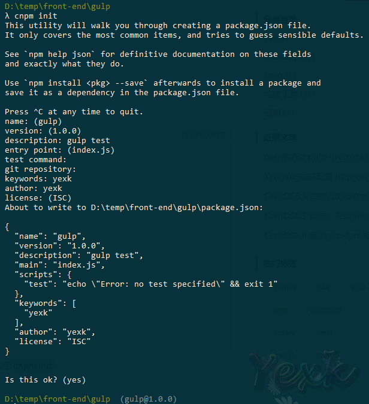
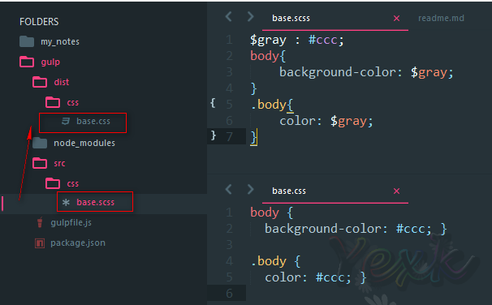

# gulp - 基于流的自动化构建工具
> gulp是前端开发过程中对代码进行构建的工具，是自动化项目的构建利器；它不仅能对网站资源进行优化，而且在开发过程中很多重复的任务能够使用正确的工具自动完成；使用它，我们不仅可以很愉快的编写代码，而且大大提高我们的工作效率。

**安装前提：需要安装nodejs环境。**

安装gulp使用命令：`cnpm install -g gulp`
> cnpm是国内镜像版的npm。[什么是npm？](../other/npm_introduction.md)

## 快速入门
### 创建项目
初始化一个node项目。需要配置一个package.json文件放到项目的根目录。


### 本地项目安装gulp
在项目的更目录下安装gulp，执行命令：`cnpm install gulp --save-dev`
> 一般工具这类的东西都安装到**-dev**环境下。


### 本地安装gulp插件
这里拿编译sass的插件举例子。其他的插件也大小雷同。
安装命令：`cnpm install gulp-sass --save-dev`


> **安装常用插件**：

| 名称 | 包名 |
| ---  | ---  |
| sass的编译 | gulp-sass |
| 编译 Less| gulp-less |
| 自动添加css前缀 | gulp-autoprefixer |
| 压缩css  | gulp-minify-css |
| 压缩html |  gulp-minify-html |
| js代码校验 | gulp-jshint |
| 合并js文件 | gulp-concat |
| 压缩js代码 | gulp-uglify |
| 压缩图片 | gulp-imagemin |
| 自动刷新页面 | gulp-livereload |
| 图片缓存，只有图片替换了才压缩 | gulp-cache |
| 更改提醒 | gulp-notify |
| 清除文件 | del |
| 编译 Jade| gulp-jade |
| 创建本地服务器 | gulp-connect |
| 重命名文件 | gulp-rename |

### 在项目的更目录创建一个gulpfile.js文件
> <span style="color:red">注意：</span>这个文件名字是固定的，不允许更改。

在根目录创建文件：`gulpfile.js`
写入如下代码：
```JavaScript
const gulp = require('gulp');
const sass = require('gulp-sass');
const sass_path = './src/css/*.scss';
// 创建了一个任务，监听了scss文件，通过sass插件去编译生成css
gulp.task('sass',function(){
	console.log('this is sass task!');
	gulp.src(sass_path)
		.pipe(sass())
		.pipe(gulp.dest('./dist/css/'));
});
// 再创建一个gulp任务用于监听上面的任务。
gulp.task('default',function(){
	console.log('this is default task! i\'m watch sass task!');
	gulp.watch(sass_path,function(){
		gulp.run('sass');
	});
});
```
在`./src/css/`目录下创建一个文件,后缀为scss。如:`base.scss`。
使用sass语法写下样式文件：
```css
$gray : #ccc;
body{
	background-color: $gray;
}
.body{
	color: $gray;
}
```
启动gulp任务：

> 注意：启动命令为：gulp <task名字> 。当task名字为“defualt”的时候可以省略。

如果运行不报错可以看到自动生成了dist目录。有css/base.css文件。


> 到此gulp快速入门完成了。更多的api和教程可以查看官方的：[gulp官网的API](http://www.gulpjs.com.cn/docs/api/)。
> 次案例的源码：[code/gulp.zip](code/gulp.zip)
