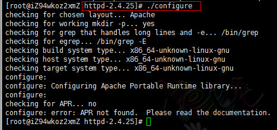
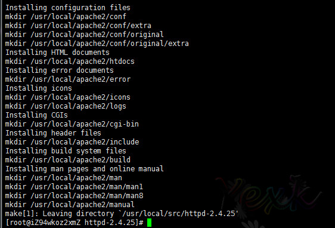
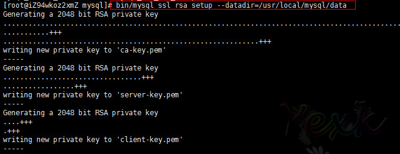
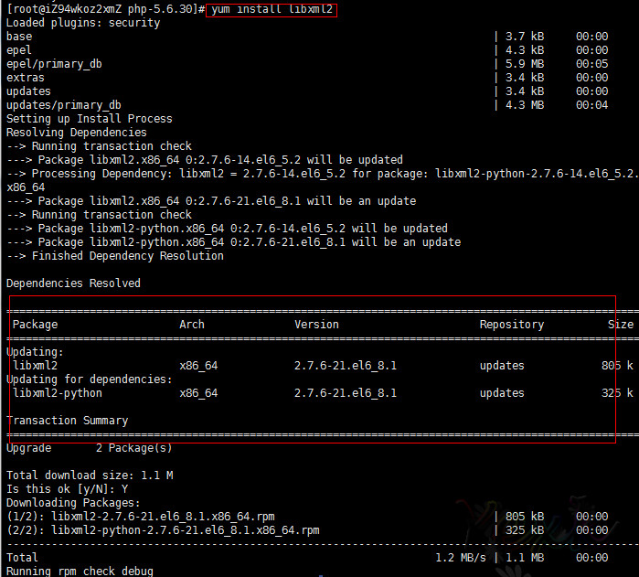
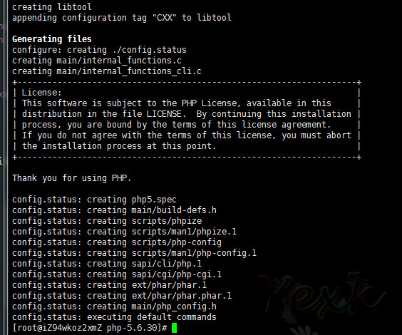
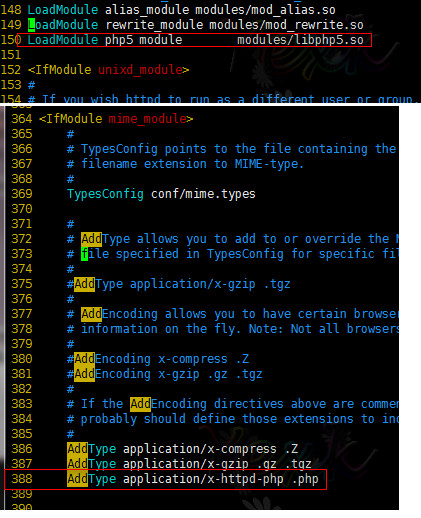

## Linux下AMP环境安装
> - 准备环境
> - Apache ： httpd-2.4.25.tar.gz [点击下载](http://mirrors.hust.edu.cn/apache//httpd/httpd-2.4.25.tar.gz)
> - MySQL ：mysql-5.7.17-linux-glibc2.5-x86_64.tar [点击下载](https://cdn.mysql.com//Downloads/MySQL-5.7/mysql-5.7.17-linux-glibc2.5-x86_64.tar)
> - PHP ： php-5.6.30.tar.gz [点击下载](http://cn2.php.net/distributions/php-5.6.30.tar.gz)
> - [Apache插件]APR : [点击下载](https://mirrors.tuna.tsinghua.edu.cn/apache//apr/apr-1.5.2.tar.gz)
> - [Apache插件]APR-Util : [点击下载](https://mirrors.tuna.tsinghua.edu.cn/apache//apr/apr-util-1.5.4.tar.gz)
> - [Apache插件]PCRE : [点击下载](https://nchc.dl.sourceforge.net/project/pcre/pcre/8.40/pcre-8.40.tar.gz)


安装正常的流程：`下载`-`上传到Linux`-`解压`-`配置`-`安装` 
安装软件的顺序基本：`Apache` - `MySQL` - `PHP`

### 安装Apache 
1. **解压**。把下载好的 `httpd-2.4.25.tar.gz` 文件上传到服务器，然后进行解压安装。
	命令：` tar -zxvf httpd-2.4.25.tar.gz `
	

2. **配置**。进入到 `httpd-2.4.25` 目录进行编译安装。

	**小插曲（在编译没有报错的情况下是可选步骤）**
	1. 在Apache2.4后的版本已经不再捆绑`APR`、`APR-Util`和`PCRE`。所有这里如果报这个错。需要先去安装这个。
		
	
	2. 把这三个包依次安装。
		`安装步骤：解压-配置-安装`
		1）安装`APR`
			解压:`tar -zxvf apr-1.5.2.tar.gz`
			进入解压后的目录:`cd apr-1.5.2`
			配置：`./configure --prefix=/usr/local/apache2/plugin/apr`(--prefix=安装路径)
			编译&安装:`make && make install`


		2) 安装`ARP-Util`
			解压:`tar -zxvf apr-util-1.5.4.tar.gz`
			进入解压后的目录:`cd apr-util-1.5.4`
			配置:`./configure --prefix=/usr/local/apache2/plugin/apr-util --with-apr=/usr/local/apache2/plugin/apr/bin/apr-1-config `(--prefix=安装路径，--with-apr=apr路径/bin/apr-1-config)
			编译&安装:`make && make install`

		3) 安装`PRCE`
			解压:`tar -zxvf pcre-8.40.tar.gz`
			进入解压后的目录:`cd pcre-8.40`
			配置:`./configure --prefix=/usr/local/apache2/plugin/prce`(--prefix=安装路径)
			编译&安装:`make && make install`

	命令：`./configure --prefix=/usr/local/apache2 --with-apr=/usr/local/apache2/plugin/apr --with-apr-util=/usr/local/apache2/plugin/apr-util --with-pcre=/usr/local/apache2/plugin/pcre`

	配置完成：
	

3. **编译&安装**
	命令：`make && make install`
	
	编译&安装完成：
	


### 安装MySQL
1. **解压**。把下载好的`mysql-5.7.17-linux-glibc2.5-x86_64.tar.gz`进行解压。
	命令：`tar -xvf mysql-5.7.17-linux-glibc2.5-x86_64.tar.gz`

2. **复制**。这是是已经编译好的文件。所以没有编译安装这回事，解压就能用了。
	命令：`cp -r ./mysql-5.7.17-linux-glibc2.5-x86_64 /usr/local/mysql`(复制到你想存放的位置)

3. **添加MySQL系统账号**。
	命令：`groupadd mysql` 和 `useradd -r -g mysql mysql `
	

4. **复制&编辑配置文件**

	复制命令：`cp ./support-files/my-default.cnf /etc/my.cnf`(提示是否覆盖，覆盖就行)
	复制命令：`cp ./support-files/mysql.server /etc/init.d/mysql`(用于快速启动的)
	

	编辑命令：`vim /etc/my.cnf`
	

5. **添加权限和数据文件夹**
	在mysql目录下我们新增一个data文件夹用于存放数据库文件。
	命令：`mkdir /usr/local/mysql/data`
	同时给mysql文件夹下的所有文件分配给mysql同时赋予755权限。
	分配用户命令：`chown -R	mysql.mysql ./mysql/`
	分配权限命令：`chmod -R 755 ./mysql/`

	> 这里我为了方便就直接给data设置777权限。

	

6. **安装&初始化数据库**
	命令：`bin/mysqld --initialize --user=mysql --basedir=/usr/local/mysql --datadir=/usr/local/mysql/data`
	> 请注意里面有个细节:最后一行有个初始化密码：`5ohVifrT<lgv` 用于待会登陆操作的。如果没有看到用命令`cat ~/.mysql_secret`查看。
	
	
	
	命令：`bin/mysql_ssl_rsa_setup --datadir=/usr/local/mysql/data`
	

	至此MySQL数据库已经安装完成。

7. **修改密码**
	通过上面一步可以发现系统为我们提供了一个初始化密码，但不好记忆。我们就会想着修改MySQL密码。

	> 第一次登陆的时候输入系统给我们初始化好的密码:`5ohVifrT<lgv`

	

	其他的配置开机启动等等

### 安装PHP
1. **解压**。把下载好的`php-5.6.30.tar.gz`进行解压。
	命令：`tar -zxvf php-5.6.30.tar.gz`

2. **配置**。这里的配置需要自己按需加载。需要开启什么扩展就添加什么扩展。
	> 这是我安装的扩展。仅供参考。
	命令：`./configure --prefix=/usr/local/php --with-mysql=mysqlnd --with-mysqli=mysqlnd  --with-apxs2=/usr/local/apache2/bin/apxs --enable-sysvsem --with-curl --enable-mbregex  --enable-mbstring --with-mcrypt --with-gd --with-mhash --enable-sockets --with-xmlrpc --with-zlib --enable-pdo --with-pdo-mysql=mysqlnd`

	**小插曲**
	
	1）配置的时候可能会遇到`configure: error: xml2-config not found. Please check your libxml2 installation.`
	需要安装`libxml2` 和 `libxml2-devel`。这里使用在线安装。
	命令：`yum install libxml2`和`yum install libxml2-devel` 
	
	
	2）或者`configure: error: Please reinstall the libcurl distribution - easy.h should be in /include/curl/`
	解决命令：`yum -y install libcurl-devel`

	3） 或者：`configure: error: png.h not found.`
	解决命令：`yum -y install libpng-devel`

	4） 或者：`configure: error: mcrypt.h not found. Please reinstall libmcrypt.`
	```
	命令：
		# wget ftp://mcrypt.hellug.gr/pub/crypto/mcrypt/libmcrypt/libmcrypt-2.5.7.tar.gz
		# tar zxf libmcrypt-2.5.7.tar.gz
		# cd libmcrypt-2.5.7
		# ./configure
		# make && make install
	```
	5）如果还有其他页面错误请自行百度。这里就不一一贴出了。

3. **编译&安装**
	命令：`make && make install`
	

	至此PHP就已经安装完成了。

### 整合配置
1） 编辑Apache的配置文件。召唤PHP小弟。
命令：`vim /usr/local/apache2/conf/httpd.conf`


> 记得重启Apache。然后测试php文件。

2）编辑PHP的配置文件。

首先源码安装的php.ini文件是在源码包里面才有的。

然后我们通过测试函数：`phpinfo();`查看php.ini应该存放的位置。


下一步复制文件
命令：`cp php.ini-production /usr/local/php/lib/php.ini`
> 重启Apache。这样配置文件就加载上了。。


---


### 问题：AH00558: httpd: Could not reliably determine the server's fully qualified domain name, using localhost.localdomain. Set the 'ServerName' directive globally to suppress this message

> 解决办法是:
vim /你的httpd路径/httpd.conf
```shell
#SeverName www.expample.com:80
# 改成
SeverName 127.0.0.1	
```
