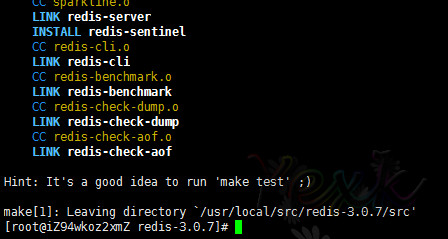

## Nosql 产品安装
> 准备环境
> - Redis : redis-3.0.7.tar.gz
> - PHPRedis : phpredis-3.1.1.tar.gz

### Redis安装
> 先把准备环境弄好。把下载好的两个包上传到Linux服务器。然后开始安装。`解压，配置，编译，安装`。

1. **解压**。  
	命令：` tar -zxvf redis-3.0.7.tar.gz`

2. **编译**。  
	进入解压后的目录，然后进行make（redis安装不需要configure的过程）  
	命令：`make`

	

3. **安装**  
	指定安装路径，进行安装。    
	命令：` make PREFIX=/usr/local/nosql/redis install`（PREFIX必须大写）

	

4. **配置信息**  
	建立redis的配置文件目录和配置文件的copy。   
	创建文件夹命令：`mkdir /etc/redis`   
	复制文件命令：`cp redis.conf /etc/redis/`   
	 
	
	
	编辑`redis.conf`，修改`daemonize no` 改成 `daemonize yes` (允许redis后台允许)
	

	至此已经安装完成。

### 安装PHPRedis 
> 上面一步是把Redis服务器搭建好。接下来的步骤就是把redis和php关联起来。

1. **解压**。  
	命令：` tar -zxvf phpredis-3.1.1.tar.gz`
	
2. **收集&配置**  
	安装PHP插件有个重要的步骤就是使用PHP去收集插件信息。  
	进入到解压后的目录。然后进行收集信息。  
	命令：`cd phpredis-3.1.1`  
	命令：`/usr/local/php/bin/phpize` (/usr/loca/php是你的安装路径)  
	  

	配置信息
	命令：` ./configure  --with-php-config=/usr/local/php/bin/php-config`	
	

3. **编译&安装**
	命令：`make && make install`
	
	
4. **PHP配置**  
	PHPredis编译好后会生成redis.so文件。这个文件的路径在：`/usr/local/php/lib/php/extensions/no-debug-zts-20131226/` 这个编译完了就会动态生成
	接下来就找到你自己的php.ini文件位置。进行如下的编辑：

	

	保存关闭。然后重启Apache。
	最后附上安装成功后的图（看到这个说明你安装成功了）：
	


# phpize 命令执行错误
> 报出如下错误。
Cannot find autoconf. Please check your autoconf installation and the
$PHP_AUTOCONF environment variable. Then, rerun this script.   


**解决办法如下**：  
安装`m4`,`autoconf`软件即可。

如果是UBUNTU的话,可以使用:
```
sudo apt-get install m4
sudo apt-get install autoconf
```

centos系统：
```
yum install m4
yum install autoconf
```

